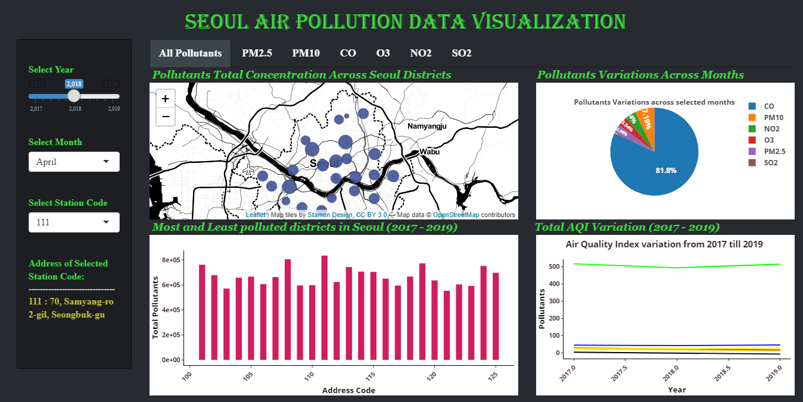
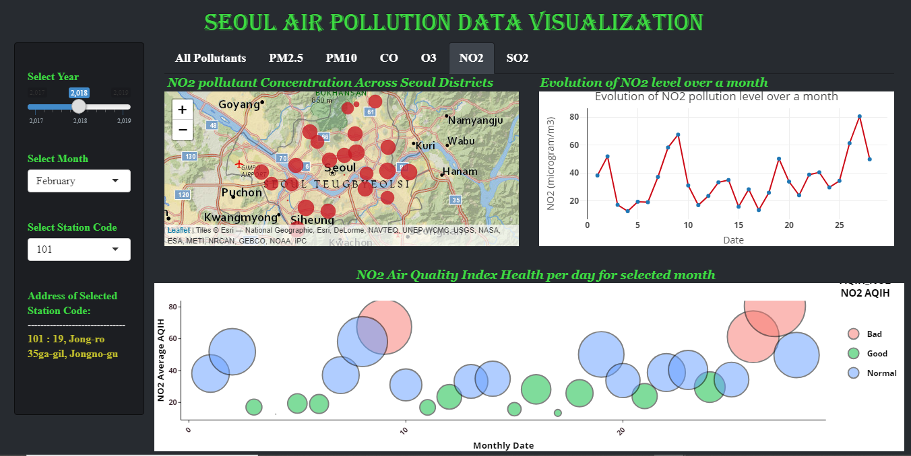

# Seoul Air Pollution Data Visualization:
----
This project is built using R Studio and R Shiny Packages with R libraries to implement the chart visualization functionalities. The dependency to execute the code and make changes in the project are R Studio, Python and R packages.

## Dependencies Installation:
- Install R Studio from https://shiny.rstudio.com/ 
- Install R from https://cran.r-project.org/bin/windows/base/
- Insatll Python from https://www.python.org/downloads/ to preprocess data if required

Once all the installation is done, install the below packages in R studio by running below mentioned commands.

```
install.packages("shiny")
install.packages("shinydashboard")
install.packages("shinythemes")
install.packages("leaflet")
install.packages("dplyr")
install.packages("leaflet.extras")
install.packages("plotly")
install.packages("data.table")
install.packages("ggplot2")
install.packages("hrbrthemes")
```
## Steps to be followed to execute the program locally:
---
- Downlaod or clone the package from https://github.com/kavyabgowda/A3-Assignment-KavyaBhadreGowda and open in R-Studio installed with above mentioned dependencies.
- To open the Project go to "A3-Assignment-KavyaBhadreGowda-master" Folder in the downloaded Package from the repository and open "AirPollutionSeoulDataVisualization" R Project File in R-Studio.
- After opening the Project open the app.R and Click on "Run in window" in R-studio to execute the project and check for results.
- Deried dataset is available in the same root directory under "data" Folder with name "Measurment-Per-Day.csv". The script used for pre-processing the data is also available in the same folder as "Script-to-format-data-by-date".
- Once the project is ran visualize the Air pollution data and do analysis by trying out various Input options provided and also clicking on Navigation bar options to see better results.

## Seoul Air Pollution Data Visualizations
----
<p align="center">
  
</p>

----
<p align="center">
  
</p>

## Contributions
----
- Contributions to improve visualizations are welcomed.
